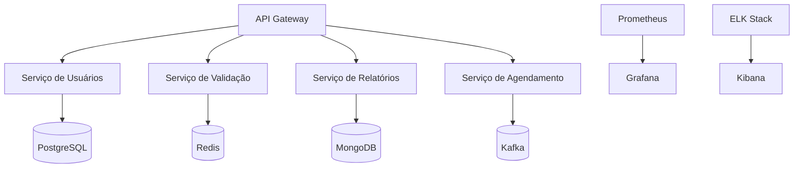

# Documentação de Arquitetura

## 1. Visão Geral

O sistema Shipay Backend é uma aplicação distribuída que utiliza uma arquitetura baseada em microserviços, seguindo os princípios de Domain-Driven Design (DDD) e Clean Architecture.

## 2. Diagrama de Arquitetura

## 3. Componentes Principais

### 3.1 API Gateway
- **Responsabilidade**: Roteamento, autenticação e rate limiting
- **Tecnologia**: FastAPI
- **Características**:
  - Validação de requisições
  - Autenticação JWT
  - Rate limiting por IP
  - Documentação Swagger/OpenAPI

### 3.2 Serviço de Usuários
- **Responsabilidade**: Gerenciamento de usuários e autenticação
- **Tecnologia**: FastAPI + PostgreSQL
- **Características**:
  - CRUD de usuários
  - Geração automática de senha
  - Validação de dados
  - Autenticação JWT

### 3.3 Serviço de Validação
- **Responsabilidade**: Validação de CNPJ e CEP
- **Tecnologia**: FastAPI + Redis
- **Características**:
  - Cache de resultados
  - Retry com backoff exponencial
  - Fallback para múltiplos provedores

### 3.4 Serviço de Relatórios
- **Responsabilidade**: Geração e consulta de relatórios
- **Tecnologia**: FastAPI + MongoDB
- **Características**:
  - Processamento assíncrono
  - Agregação de dados
  - Cache de resultados

### 3.5 Serviço de Agendamento
- **Responsabilidade**: Agendamento e processamento de eventos
- **Tecnologia**: FastAPI + Kafka
- **Características**:
  - Agendamento de eventos
  - Processamento assíncrono
  - Retry de eventos falhos

## 4. Decisões Técnicas

### 4.1 Banco de Dados
- **PostgreSQL**: Escolhido para dados transacionais (usuários) devido à sua robustez e suporte a ACID
- **MongoDB**: Utilizado para relatórios devido à sua flexibilidade e performance em consultas analíticas
- **Redis**: Empregado para cache e filas devido à sua velocidade e suporte a estruturas de dados

### 4.2 Mensageria
- **Kafka**: Selecionado para processamento assíncrono devido à sua escalabilidade e garantia de entrega
- **Características**:
  - Particionamento de tópicos
  - Retenção configurável
  - Replay de mensagens

### 4.3 Monitoramento
- **Prometheus**: Coleta de métricas
- **Grafana**: Visualização de métricas
- **ELK Stack**: Logs e análise
- **Características**:
  - Métricas em tempo real
  - Alertas configuráveis
  - Análise de logs

## 5. Padrões Utilizados

### 5.1 Clean Architecture
- Separação clara de responsabilidades
- Independência de frameworks
- Testabilidade
- Manutenibilidade

### 5.2 Domain-Driven Design
- Modelagem baseada em domínio
- Bounded Contexts
- Aggregates
- Value Objects

### 5.3 CQRS
- Separação de comandos e consultas
- Otimização de leitura e escrita
- Escalabilidade independente

### 5.4 Event Sourcing
- Rastreamento de mudanças
- Reconstrução de estado
- Auditoria

## 6. Segurança

### 6.1 Autenticação
- JWT com expiração
- Refresh tokens
- Rate limiting

### 6.2 Autorização
- RBAC (Role-Based Access Control)
- Permissões granulares
- Validação de escopo

### 6.3 Proteção de Dados
- Criptografia em trânsito (TLS)
- Criptografia em repouso
- Sanitização de inputs

## 7. Escalabilidade

### 7.1 Horizontal
- Stateless services
- Load balancing
- Sharding de dados

### 7.2 Vertical
- Otimização de queries
- Cache em múltiplas camadas
- Compressão de dados

## 8. Resiliência

### 8.1 Circuit Breaker
- Prevenção de cascata de falhas
- Fallback strategies
- Recuperação automática

### 8.2 Retry
- Backoff exponencial
- Jitter
- Timeouts configuráveis

### 8.3 Bulkhead
- Isolamento de recursos
- Limites de concorrência
- Priorização de serviços

## 9. Deploy

### 9.1 Infraestrutura
- Kubernetes
- Docker
- Helm

### 9.2 CI/CD
- GitHub Actions
- ArgoCD
- Testes automatizados

## 10. Observabilidade

### 10.1 Métricas
- Latência
- Throughput
- Erros
- Recursos

### 10.2 Logs
- Estruturação
- Agregação
- Análise

### 10.3 Traces
- Distributed tracing
- Performance analysis
- Dependency mapping 